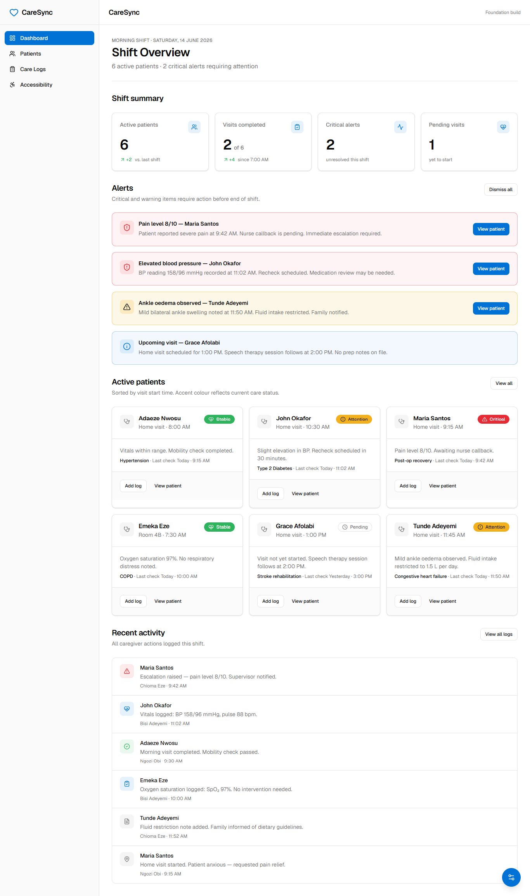
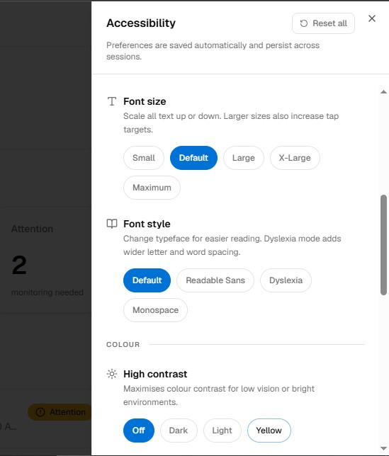
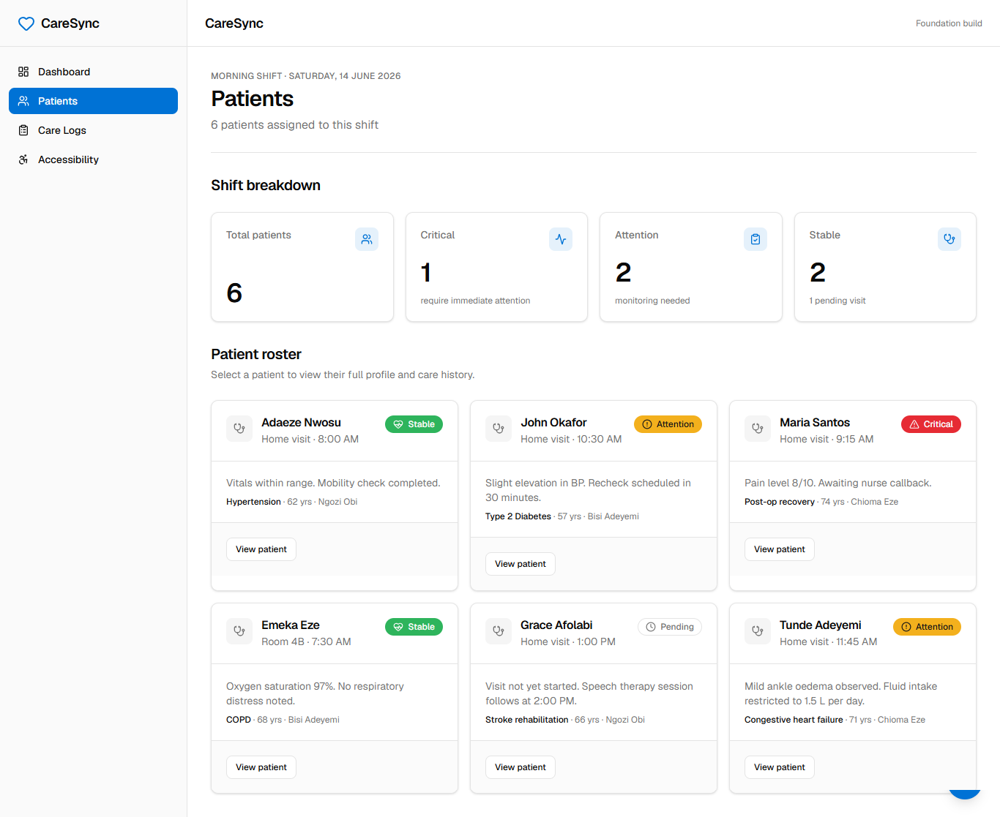
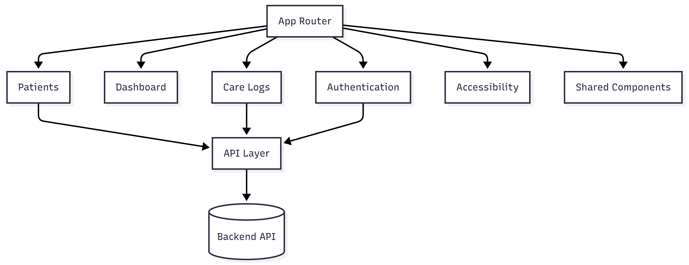

# CareSync

<p align="center">
  <strong>An accessibility-first healthcare coordination platform for managing patient care, Personal Support Workers (PSWs), and healthcare operations.</strong>
</p>

<p align="center">
  🚧 <strong>Currently in Active Development</strong>
</p>

<p align="center">
  <a href="https://caresync-six.vercel.app/">Live Demo</a> •
  <a href="https://github.com/malvisanochie1/caresync.git">Source Code</a>
</p>

---

## Application Preview

### Dashboard



---

### Accessibility Panel



---

### Patient View



---

# About CareSync

CareSync is a modern healthcare coordination platform designed to simplify the day-to-day management of patient care while improving collaboration between **Personal Support Workers (PSWs), healthcare administrators, patients, and their families**.

The platform provides a centralized workspace for documenting care activities, managing patient assignments, tracking visits, monitoring progress, and improving communication across the care team.

Unlike many healthcare management systems that prioritize administrative functionality alone, CareSync is being built with an equally strong emphasis on **accessibility**, **usability**, **performance**, and **scalability**.

The goal is to create software that not only helps healthcare organizations manage care more efficiently but also ensures that every user regardless of age, visual ability, or technical experience can comfortably interact with the application.

---

# Why CareSync?

Healthcare coordination often involves multiple people working together to provide consistent, high-quality care.

Without a centralized platform, healthcare providers frequently encounter challenges such as:

* Scattered patient information
* Manual documentation
* Inefficient communication
* Difficulty tracking completed visits
* Limited visibility into ongoing patient care
* Accessibility barriers for users with visual or cognitive impairments

CareSync was created to address these challenges by bringing every aspect of the care workflow into one intuitive, accessible, and responsive application.

Rather than functioning as just another management dashboard, CareSync is designed to become a collaborative platform where healthcare professionals can confidently manage care while patients and families benefit from greater transparency and improved communication.

---

# Core Features

## Healthcare Management

* Patient Management
* Personal Support Worker (PSW) Management
* Patient Assignment Tracking
* Care Log Creation
* Visit Documentation
* Care Progress Monitoring
* Role-Based Workflows
* Responsive Administrative Dashboard

---

## Frontend Engineering

CareSync is built using modern frontend engineering principles to ensure long-term maintainability and scalability.

Current engineering highlights include:

* Component-Based Architecture
* Responsive Design
* REST API Integration
* CRUD Operations
* Type-Safe Development with TypeScript
* Reusable UI Components
* Modular Code Organization
* Performance Optimization
* Responsive Dashboard Design
* Modern React Patterns
* Clean State Management
* Scalable Project Structure

---

## Accessibility Features

Accessibility is a foundational feature of CareSync rather than an enhancement added later in development.

Users can personalize the application according to their individual accessibility needs through a comprehensive preference system.

### Accessibility Presets

* Low Vision
* Dyslexia
* Senior Mode
* Night Shift

### Typography

* Adjustable Font Size
* Multiple Font Families
* Dyslexia-Friendly Typography

### Visual Preferences

* High Contrast Modes
* Background Colour Customization
* Text Colour Customization

### Motion & Navigation

* Reduced Motion
* Motion-Free Experience
* Enhanced Keyboard Focus Indicators

### Layout Preferences

* Adjustable Interface Spacing
* Comfortable Reading Layouts
* Larger Interactive Elements

### Persistence

Accessibility preferences are automatically saved and restored across sessions, allowing users to maintain a personalized experience every time they return to the application.

---

# Design Philosophy

CareSync is built around one simple principle:

> **Healthcare software should adapt to its users, not force users to adapt to the software.**

Many people receiving support from Personal Support Workers are older adults or individuals living with temporary or permanent health conditions. These users may experience reduced vision, cognitive challenges, limited mobility, or varying levels of digital literacy.

Because of this, accessibility, clarity, and usability are treated as core product requirements rather than optional enhancements.

Every interface, interaction, and workflow is designed with the user in mind.

The application follows these guiding principles:

## Accessibility First

Accessibility is integrated into the platform from the beginning of development. Users can personalize typography, colour themes, spacing, motion preferences, and interface contrast to create an experience that best supports their individual needs.

---

## User-Centered Design

Every feature is designed to reduce friction and simplify daily healthcare workflows for administrators, Personal Support Workers, patients, and family members.

---

## Simplicity Over Complexity

Interfaces prioritize clarity and ease of use, helping users complete important healthcare tasks quickly without unnecessary complexity.

---

## Scalable Architecture

Reusable components, modular organization, and clean separation of concerns allow the platform to evolve without sacrificing maintainability.

---

## Performance Matters

Fast interactions, optimized rendering, and responsive layouts ensure the platform remains efficient across a wide range of devices and network conditions.

---

## Consistency Through Reusability

Shared components, standardized design patterns, and reusable utilities provide a consistent user experience while simplifying future development.

---

# Why Accessibility Matters

Accessibility is one of the defining goals of CareSync.

Many individuals receiving personal support services are older adults or people living with temporary or permanent health conditions. These users may experience challenges such as reduced vision, difficulty reading small text, sensitivity to motion, or cognitive conditions like dyslexia.

Rather than assuming every user has the same needs, CareSync empowers individuals to customize the application according to their own preferences.

Users can increase font sizes, improve colour contrast, reduce animations, adjust spacing, switch to dyslexia-friendly typography, and choose accessibility presets specifically designed to improve readability and comfort.

By treating accessibility as a core engineering requirement instead of an optional feature, CareSync aims to provide a more inclusive experience for everyone involved in the care process.

Accessibility is not simply about compliance, it is about ensuring that technology remains usable, comfortable, and empowering for every person who depends on it.


# Frontend Architecture

CareSync follows a modular, feature-based architecture that separates business logic, reusable UI components, API interactions, and utilities. This structure keeps the codebase scalable, maintainable, and easy to extend as new healthcare features are introduced.

mermaid



### Project Structure

```text
app/
components/
features/
hooks/
lib/
services/
types/
utils/
```

---

# Technical Decisions

## Why Next.js?

Next.js provides server-side rendering, file-based routing, optimized image handling, and excellent performance out of the box. It also offers a scalable foundation as CareSync grows into a larger healthcare platform.

---

## Why TypeScript?

Healthcare applications manage important information where reliability matters. TypeScript improves code quality through static typing, reduces runtime errors, and makes the codebase easier to maintain as new features are added.

---

## Why Tailwind CSS?

Tailwind CSS enables rapid UI development while maintaining a consistent design system. Utility-first styling also makes responsive layouts and accessibility-focused design easier to implement.

---

## Why Component-Based Architecture?

The interface is built from reusable components to encourage consistency, reduce duplicated code, and simplify maintenance across multiple pages and workflows.

---

## Why Persistent Accessibility Preferences?

Accessibility settings are automatically saved so users don't need to reconfigure the interface every time they return. This creates a more comfortable and personalized experience, particularly for users who rely on specific accessibility options.

---

## Why Role-Based Design?

Different users interact with the platform in different ways. Administrators, Personal Support Workers, patients, and family members each require interfaces tailored to their responsibilities, making role-based design essential for both usability and future scalability.

---

# Technical Challenges

Some of the key engineering challenges addressed during development include:

* Building a reusable accessibility preference system.
* Designing scalable UI components for multiple user roles.
* Organizing the application using a modular architecture.
* Integrating REST APIs while maintaining clean separation of concerns.
* Balancing performance, responsiveness, and accessibility across the application.

---

# Tech Stack

### Frontend

* Next.js
* React
* TypeScript
* Tailwind CSS

### Development

* REST APIs
* CRUD Operations
* Git & GitHub
* Responsive Design
* Accessibility (WCAG-focused)
* Component-Based Architecture
* Performance Optimization

# Project Status

> 🚧 **Active Development**

CareSync is actively being developed with a focus on building a scalable, accessible, and production-ready healthcare management platform.

### Completed

* Responsive user interface
* Modern dashboard layout
* Accessibility preference system
* Care log interface
* Patient management interface
* REST API integration
* CRUD operations
* Reusable component architecture
* Theme customization
* Persistent accessibility preferences

### In Progress

* Authentication & authorization
* Role-based permissions
* Backend integration
* Patient assignment workflows
* Reporting & analytics
* Notifications
* Performance improvements

---

# Roadmap

### Phase 1 — Foundation ✅

* Project setup
* Design system
* Responsive layouts
* Accessibility engine
* API integration
* CRUD functionality

### Phase 2 — Healthcare Workflows 🚧

* Authentication
* Patient assignments
* Care visit tracking
* Staff management
* Family dashboard

### Phase 3 — Production

* Notifications
* Reports & analytics
* Audit logs
* Advanced search & filtering
* Testing
* Deployment

---

# Getting Started

## Prerequisites

Before running the project locally, ensure you have:

* Node.js 18+
* npm, pnpm, yarn, or bun
* Git

---

## Installation

Clone the repository:

```bash
git clone https://github.com/malvisanochie1/caresync.git
```

Navigate into the project:

```bash
cd caresync
```

Install dependencies:

```bash
npm install
```

Start the development server:

```bash
npm run dev
```

Open your browser and visit:

```text
http://localhost:3000
```

---

# Future Improvements

Planned enhancements include:

* Secure authentication and authorization
* Real-time notifications
* Appointment scheduling
* Advanced reporting and analytics
* Family communication portal
* Offline support
* Comprehensive testing
* Performance monitoring
* AI-assisted care insights

---

# Contributing

Contributions, suggestions, and feedback are welcome.

If you'd like to contribute:

1. Fork the repository.
2. Create a new feature branch.
3. Commit your changes.
4. Submit a Pull Request.

---

# License

This project is currently available for learning, demonstration, and portfolio purposes.

A production license will be added as development progresses.

---

# Author

## Chisom Malvis

Frontend Engineer with 4 years of hands-on experience building modern, scalable, and accessible web applications using React, Next.js, TypeScript, and Tailwind CSS.

I enjoy building products that combine thoughtful user experiences with clean architecture, reusable components, performance optimization, and accessibility-first design.

### Connect With Me

* Portfolio:https://malvis-portfolio.vercel.app/
* GitHub: **https://github.com/malvisanochie1**
* LinkedIn: **(https://www.linkedin.com/in/malvis-nwakonobi-67b644277/)**

---

<p align="center">
Built with ❤️ using Next.js, React, TypeScript, and Tailwind CSS.
</p>
